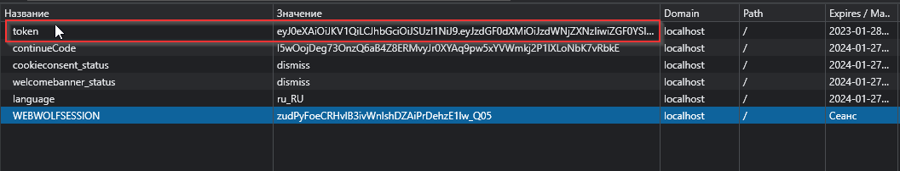
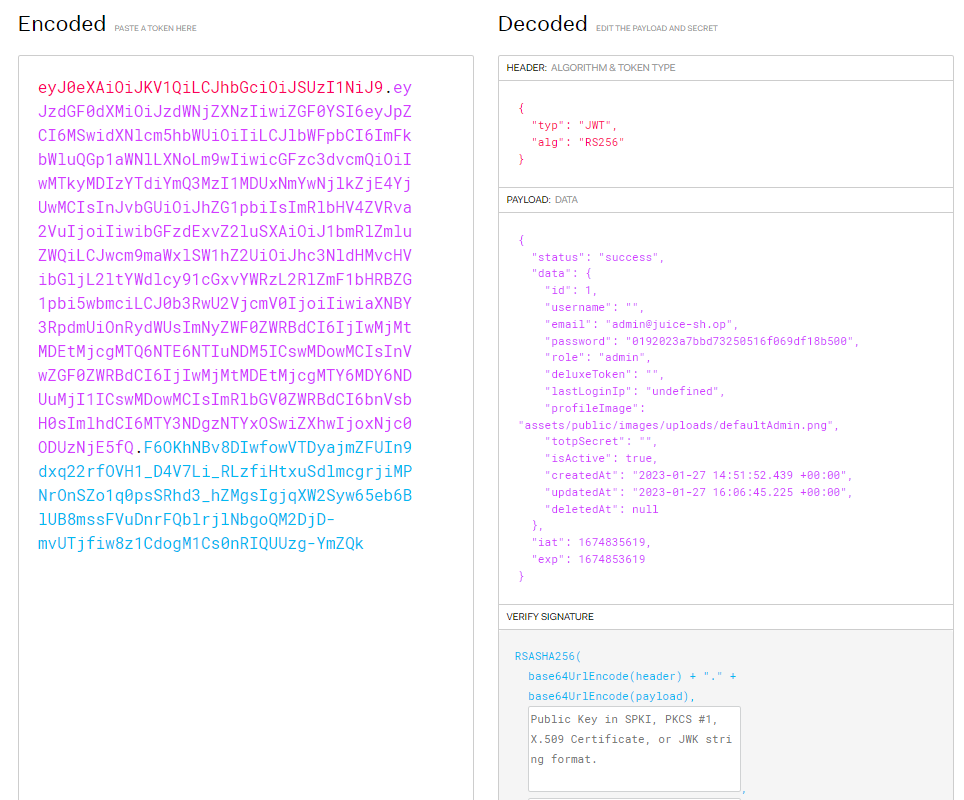
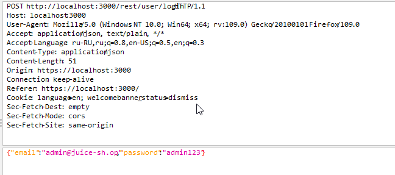
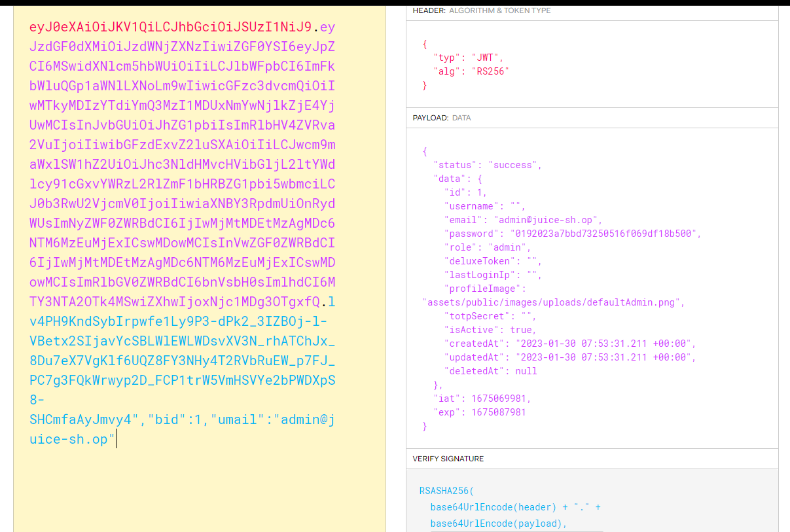

# Домашнее задание к занятию «2.1. OWASP»

## Задание SQLi
### Решение задания

В качестве решения пришлите:
1. Использованные для ввода данные.  
```
{
  "email": "' or 1=1--",
  "password": " "
}
```
2. Под каким пользователем вам удалось войти.  
`admin@juice-sh.op`
3. Ваши предположения, почему удалось войти именно под этим пользователем.  
`Вероятно выбирается первый пользователь из выдачи.  
Сортировка идет по первичному ключу или кластерному индексу и возвращается первый созданный пользователь`
4. Где хранится аутентификационная информация, что она из себя представляет и как передаётся в каждом запросе.  
Хранится в cookie, в формате JWT токена  

  

## Задание robots.txt
### Решение задания

Пришлите ваш вывод, корректно ли используется `robots.txt`. Если нет, то почему и к каким последствиям это ведёт.  

```
User-agent: *
Disallow: /ftp
```

Это файл содержит правила для роботов, которые сканируют и индексируют страницы сайтов.  
И в данном случае мы говорим роботам не сканировать директорию `/ftp`  
Однако, это правило не обязательно к исполнению и робот может его не выполнить. Для управления доступом к директории необходимо использовать аутентификацию, в противном случае этот файл просто подсказывает злоумышленнику список открытых директорий сайта.  

## Задание «Взлом администратора»
### Решение задания
Пришлите пароль, который стоял у администратора. Объясните, какие меры позволили бы защититься от атаки.  
Пароль - `admin123`
Меры: 
1. Более сложный пароль  
2. Лимит попыток авторизаци по пользователю
3. Добавление задержки ответа. В совокупности со сложным паролем перебор будет очень долгий.
4. Дополнение к п.2, фильтрация запросов. 
   Настройка IPS/IDS.


  