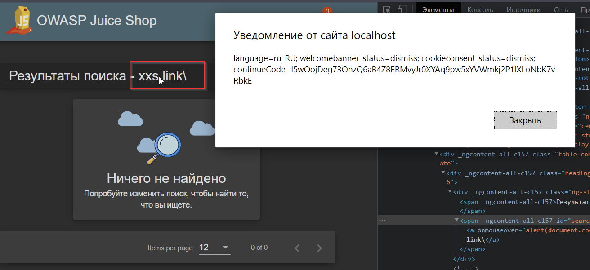
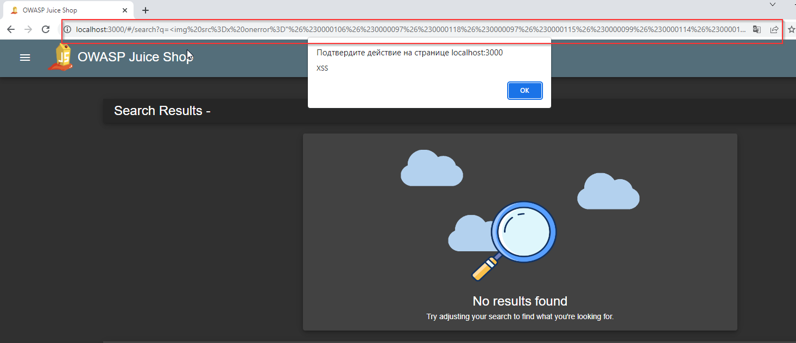
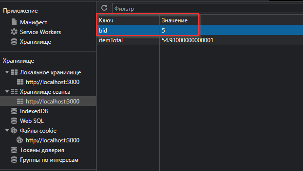
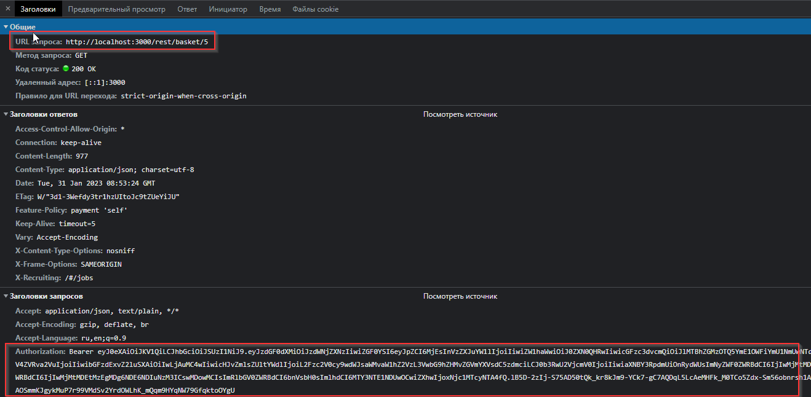
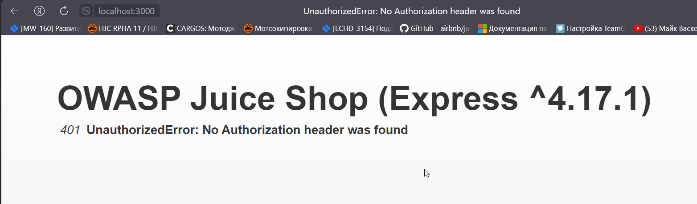

# Домашнее задание к занятию «2.2. OWASP»
## Задание «Поиск»
### Этапы выполнения

1. Проверьте поле поиска на сайте на подверженность XSS.
2. Проанализируйте, возможно ли ссылку, полученную в результате ввода в строку поиска, передать другому человеку, чтобы получить Reflected XSS. 

### Решение задания

В качестве решения пришлите:
1. Использованные данные для ввода.  
Для внедрения XSS можно использовать самый простой тег с обработкой событий:  
`<a onmouseover="alert(document.cookie)"\>xxs link\</a\>`  
  
При этом такую ссылку нельзя использовать для получения `Reflected XSS`, т.к. браузер кодирует строку `url`  
Пример: `http://localhost:3000/#/search?q=%3Ca%20onmouseover%3D%22alert(document.cookie)%22%5C%3Exxs%20link%5C%3C%2Fa%5C%3E`  

Можно использовать например такую строку:  
``  
 
2. Пункт из XSS Cheat Sheet, в котором содержится пример для проверки подверженности поля поиска XSS.  
Пункт `XSS Locator (Polygot)`
Для теста использовал - `<svg/onload='+/"/+/onmouseover=1/+/[*/[]/+alert(1)//'>`
После поиска получил такую разметку - `<svg onload="+/&quot;/+/onmouseover=1/+/[*/[]/+alert(1)//"></svg>`  

## Задание «Чужая корзина»

Найдите IDOR в корзине. Посмотрите, что лежит в чужих корзинах. 

### Этапы выполнения

1. Положите что-то в свою корзину. 
2. Откройте саму корзину и инструменты разработчика. 
3. Проанализируйте, что лежит в куках и локальном хранилище. Попробуйте изменить данные, обновите страницу. 

### Решение задания

В качестве решения пришлите:
1. Наименование параметра, который отвечает за открываемую корзину.  
Параметр `bid` в хранилище сеанса  
 
 
 
2. Ваши рекомендации по исправлению этой незначительной уязвимости.  

Запрос данных корзины по идентификатору защищен проверкой авторизационной куки, однако нет проверки владельца корзины.
Хотя в ответе на запрос `http://localhost:3000/rest/basket/5`  
есть UserId владельца. Необходимо добавить разграничение доступа к корзинам по идентификатору владельца.
 
Запрос карзины:  
```
{
  "status": "success",
  "data": {
    "id": 5,
    "coupon": null,
    "UserId": 16,
    "createdAt": "2023-01-30T07:53:32.495Z",
    "updatedAt": "2023-01-30T07:53:32.495Z",
    "Products": [
      {
        "id": 3,
        "name": "Канистелевый сок (500мл)",
        "description": "Now with even more exotic flavour.",
        "price": 8.99,
        "deluxePrice": 8.99,
        "image": "eggfruit_juice.jpg",
        "createdAt": "2023-01-30T07:53:32.209Z",
        "updatedAt": "2023-01-30T07:53:32.209Z",
        "deletedAt": null,
        "BasketItem": {
          "ProductId": 3,
          "BasketId": 5,
          "id": 7,
          "quantity": 5,
          "createdAt": "2023-01-30T07:53:32.570Z",
          "updatedAt": "2023-01-30T07:53:32.570Z"
        }
      },
      {
        "id": 4,
        "name": "Малиновый сок (1000мл)",
        "description": "Made from blended Raspberry Pi, water and sugar.",
        "price": 4.99,
        "deluxePrice": 4.99,
        "image": "raspberry_juice.jpg",
        "createdAt": "2023-01-30T07:53:32.209Z",
        "updatedAt": "2023-01-30T07:53:32.209Z",
        "deletedAt": null,
        "BasketItem": {
          "ProductId": 4,
          "BasketId": 5,
          "id": 8,
          "quantity": 2,
          "createdAt": "2023-01-30T07:53:32.570Z",
          "updatedAt": "2023-01-30T07:53:32.570Z"
        }
      }
    ]
  }
}
```